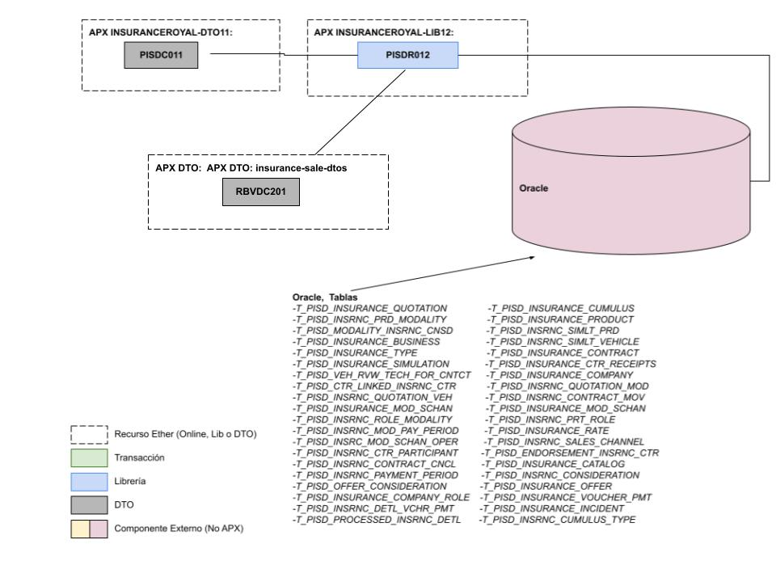

# 
# Recurso APX Library PISDR012

El objetivo de este documento es proveer informacion relacionada de la Libreria PISDR012 online dentro de este recurso que ha sido implementado sobre la Arquitectura APX y desplegado a traves de la Consola Ether.

### 1.  Funcionalidad

>Esta Librería APX tiene como objetivo realizar las distintas operaciones que se necesitan en la BD.

#### 1.1 Caso de Uso:

> El uso de la Librería PISDR012 está orientado a realizar consultas, inserts, updates en la BD.

### 2. Capacidades:

> Esta **librería** brinda la capacidad a los aplicativos de poder realizar las operaciones necesarias en la BD.

#### 2.1 Método 1: executeInsuranceProduct(Map<String, Object> arguments)
> Método que hace una consulta a la tabla T_PISD_INSURANCE_PRODUCT

##### 2.1.1 Datos de Entrada

|#|Nombre del Atributo|Tipo de Dato| Descripción|
| :----|:---------- |:--------------| :-----|
|1| arguments | Map | Mapa que contiene el nombre y el valor de los filtros de la consulta sql |

##### 2.1.2 Datos de Salida

|#|Nombre del Atributo|Tipo de Dato| Descripción|
| :----|:---------- |:--------------| :-----|
|1| responseInsuranceProduct | Map | Mapa que contiene el valor de los campos de la fila devuelta |

##### 2.1.3 Ejemplo
```java
Map<String, Object> responseInsuranceProduct = pisdR012.executeInsuranceProduct(Map<String, Object> arguments);
```

#### 2.2 Método 2: executeGetProductIdForRimac(Map<String, Object> arguments)
> Método que hace una consulta a la tabla T_PISD_INSURANCE_BUSINESS

##### 2.2.1 Datos de Entrada

|#|Nombre del Atributo|Tipo de Dato| Descripción|
| :----|:---------- |:--------------| :-----|
|1| arguments | Map | Mapa que contiene el nombre y el valor de los filtros de la consulta sql |

##### 2.2.2 Datos de Salida

|#|Nombre del Atributo|Tipo de Dato| Descripción|
| :----|:---------- |:--------------| :-----|
|1| responseInsuranceBusiness | Map | Mapa que contiene el valor de los campos de la fila devuelta |

##### 2.2.3 Ejemplo
```java
Map<String, Object> responseInsuranceBusiness = pisdR012.executeGetProductIdForRimac(Map<String, Object> arguments);
```

#### 2.3 Método 3: executeInsuranceProductModality(Map<String, Object> arguments)
> Método que hace una consulta a la tabla T_PISD_INSRNC_PRD_MODALITY

##### 2.3.1 Datos de Entrada

|#|Nombre del Atributo|Tipo de Dato| Descripción|
| :----|:---------- |:--------------| :-----|
|1| arguments | Map | Mapa que contiene el nombre y el valor de los filtros de la consulta sql |

##### 2.3.2 Datos de Salida

|#|Nombre del Atributo|Tipo de Dato| Descripción|
| :----|:---------- |:--------------| :-----|
|1| responseInsuranceProductModality | Map | Mapa que contiene el listado de campos de las filas devueltas |

##### 2.3.3 Ejemplo
```java
Map<String, Object> responseInsuranceProductModality = pisdR012.executeInsuranceProductModality(Map<String, Object> arguments);
```

#### 2.4 Método 4: executeGetConsiderations(Map<String, Object> arguments)
> Método que hace una consulta a la tabla T_PISD_MODALITY_INSRNC_CNSD

##### 2.4.1 Datos de Entrada

|#|Nombre del Atributo|Tipo de Dato| Descripción|
| :----|:---------- |:--------------| :-----|
|1| arguments | Map | Mapa que contiene el nombre y el valor de los filtros de la consulta sql |

##### 2.4.2 Datos de Salida

|#|Nombre del Atributo|Tipo de Dato| Descripción|
| :----|:---------- |:--------------| :-----|
|1| responseConsiderations | Map | Mapa que contiene el listado de campos de las filas devueltas |

##### 2.4.3 Ejemplo
```java
Map<String, Object> responseConsiderations = pisdR012.executeGetConsiderations(Map<String, Object> arguments);
```

#### 2.5 Método 5: executeGetSimulationId()
> Método que devuelve el último id generado en la tabla de simulación

##### 2.5.1 Datos de Entrada

    Ninguno

##### 2.5.2 Datos de Salida

|#|Nombre del Atributo|Tipo de Dato| Descripción|
| :----|:---------- |:--------------| :-----|
|1| responseGetInsuranceSimulationId | Map | Mapa que contiene el valor del id devuelto |

##### 2.5.3 Ejemplo
```java
Map<String, Object> responseGetInsuranceSimulationId = pisdR012.executeGetSimulationId();
```

#### 2.6 Método 6: executeSaveSimulation(Map<String, Object> arguments)
> Método que inserta un nuevo registro en la tabla T_PISD_INSURANCE_SIMULATION

##### 2.6.1 Datos de Entrada

|#|Nombre del Atributo|Tipo de Dato| Descripción|
| :----|:---------- |:--------------| :-----|
|1| arguments | Map | Mapa que contiene el nombre y el valor de los campos a insertar en la tabla |

##### 2.6.2 Datos de Salida

|#|Nombre del Atributo|Tipo de Dato| Descripción|
| :----|:---------- |:--------------| :-----|
|1| saveSimulationExecuted | Boolean | Determina si el insert se realizó correctamente |

##### 2.6.3 Ejemplo
```java
boolean saveSimulationExecuted = pisdR012.executeSaveSimulation(Map<String, Object> arguments);
```

#### 2.7 Método 7: executeSaveSimulationProduct(Map<String, Object> arguments)
> Método que inserta un nuevo registro en la tabla T_PISD_INSRNC_SIMLT_PRD

##### 2.7.1 Datos de Entrada

|#|Nombre del Atributo|Tipo de Dato| Descripción|
| :----|:---------- |:--------------| :-----|
|1| arguments | Map | Mapa que contiene el nombre y el valor de los campos a insertar en la tabla |

##### 2.7.2 Datos de Salida

    Ninguno

##### 2.7.3 Ejemplo
```java
pisdR012.executeSaveSimulationProduct(Map<String, Object> arguments);
```

#### 2.8 Método 8: executeSaveSimulationVehicle(Map<String, Object> arguments)
> Método que inserta un nuevo registro en la tabla T_PISD_INSRNC_SIMLT_VEHICLE

##### 2.8.1 Datos de Entrada

|#|Nombre del Atributo|Tipo de Dato| Descripción|
| :----|:---------- |:--------------| :-----|
|1| arguments | Map | Mapa que contiene el nombre y el valor de los campos a insertar en la tabla |

##### 2.8.2 Datos de Salida

    Ninguno

##### 2.8.3 Ejemplo
```java
pisdR012.executeSaveSimulationVehicle(Map<String, Object> arguments);
```

#### 2.9 Método 9: executeGetInsuranceQuotation(String quotationId)
> Método que hace una consulta a la tabla T_PISD_INSRNC_QUOTATION_MOD

##### 2.9.1 Datos de Entrada

|#|Nombre del Atributo|Tipo de Dato| Descripción|
| :----|:---------- |:--------------| :-----|
|1| quotationId | String | Código de cotización BBVA |

##### 2.9.2 Datos de Salida

|#|Nombre del Atributo|Tipo de Dato| Descripción|
| :----|:---------- |:--------------| :-----|
|1| response | List | Lista que contiene el valor de los campos de las filas devueltas |

##### 2.9.3 Ejemplo
```java
List<Map<String, Object>> response = pisdR012.executeGetInsuranceQuotation(String quotationId);
```

#### 2.10 Método 10: executeGetInsuranceSimulationIdAndExpiredDate(String quotationId)
> Método que hace una consulta a la tabla T_PISD_INSURANCE_SIMULATION

##### 2.10.1 Datos de Entrada

|#|Nombre del Atributo|Tipo de Dato| Descripción|
| :----|:---------- |:--------------| :-----|
|1| quotationId | String | Código de cotización Rimac |

##### 2.10.2 Datos de Salida

|#|Nombre del Atributo|Tipo de Dato| Descripción|
| :----|:---------- |:--------------| :-----|
|1| responseQueryGetInsuranceSimulationIdAndExpiredDate | Map | Mapa que contiene el valor de los campos devueltos |

##### 2.10.3 Ejemplo
```java
Map<String, Object> responseQueryGetInsuranceSimulationIdAndExpiredDate = pisdR012.executeGetInsuranceSimulationIdAndExpiredDate(String quotationId);
```

#### 2.11 Método 11: executeSaveInsuranceQuotation(Map<String, Object> arguments)
> Método que inserta un nuevo registro a la tabla T_PISD_INSURANCE_QUOTATION

##### 2.11.1 Datos de Entrada

|#|Nombre del Atributo|Tipo de Dato| Descripción|
| :----|:---------- |:--------------| :-----|
|1| arguments | Map | Mapa que contiene el nombre y el valor de los campos a insertar en la tabla |

##### 2.11.2 Datos de Salida

    Ninguno

##### 2.11.3 Ejemplo
```java
pisdR012.executeSaveInsuranceQuotation(Map<String, Object> arguments);
```

#### 2.12 Método 12: executeSaveInsuranceQuotationMod(Map<String, Object> arguments)
> Método que inserta un nuevo registro a la tabla T_PISD_INSRNC_QUOTATION_MOD

##### 2.12.1 Datos de Entrada

|#|Nombre del Atributo|Tipo de Dato| Descripción|
| :----|:---------- |:--------------| :-----|
|1| arguments | Map | Mapa que contiene el nombre y el valor de los campos a insertar en la tabla |

##### 2.12.2 Datos de Salida

    Ninguno

##### 2.12.3 Ejemplo
```java
pisdR012.executeSaveInsuranceQuotationMod(Map<String, Object> arguments);
```

#### 2.13 Método 13: executeSaveInsuranceQuotationVeh(Map<String, Object> arguments)
> Método que inserta un nuevo registro a la tabla T_PISD_INSRNC_QUOTATION_VEH

##### 2.13.1 Datos de Entrada

|#|Nombre del Atributo|Tipo de Dato| Descripción|
| :----|:---------- |:--------------| :-----|
|1| arguments | Map | Mapa que contiene el nombre y el valor de los campos a insertar en la tabla |

##### 2.13.2 Datos de Salida

    Ninguno

##### 2.13.3 Ejemplo
```java
pisdR012.executeSaveInsuranceQuotationVeh(Map<String, Object> arguments);
```

#### 2.14 Método 14: executeGetCompanyDescById(BigDecimal companyId)
> Método que hace una consulta a la tabla T_PISD_INSURANCE_COMPANY

##### 2.14.1 Datos de Entrada

|#|Nombre del Atributo|Tipo de Dato| Descripción|
| :----|:---------- |:--------------| :-----|
|1| companyId | BigDecimal | Id de la compañía aseguradora |

##### 2.14.2 Datos de Salida

|#|Nombre del Atributo|Tipo de Dato| Descripción|
| :----|:---------- |:--------------| :-----|
|1| responseQuerySelectInsuranceCompany | Map | Mapa que contiene el valor de los campos devueltos |

##### 2.14.3 Ejemplo
```java
Map<String, Object> responseQuerySelectInsuranceCompany = pisdR012.executeGetCompanyDescById(BigDecimal companyId);
```

#### 2.15 Método 15: executeGetRequiredFieldsForEmissionService(String policyQuotaInternalId)
> Método que hace una consulta a la tabla T_PISD_INSRNC_QUOTATION_MOD junto con unos joins a las tablas T_PISD_INSRNC_PRD_MODALITY,
> T_PISD_INSRNC_PAYMENT_PERIOD, T_PISD_INSURANCE_QUOTATION, T_PISD_INSURANCE_PRODUCT.

##### 2.15.1 Datos de Entrada

|#|Nombre del Atributo|Tipo de Dato| Descripción|
| :----|:---------- |:--------------| :-----|
|1| policyQuotaInternalId | String | Código de cotización del BBVA |

##### 2.15.2 Datos de Salida

|#|Nombre del Atributo|Tipo de Dato| Descripción|
| :----|:---------- |:--------------| :-----|
|1| responseQueryGetRequiredFieldsForEmission | Map | Mapa que contiene el valor de los campos devueltos |

##### 2.15.3 Ejemplo
```java
Map<String, Object> responseQueryGetRequiredFieldsForEmission = pisdR012.executeGetRequiredFieldsForEmissionService(String policyQuotaInternalId);
```

#### 2.16 Método 16: executeSaveContract(Map<String, Object> arguments)
> Método que realiza un registro en la tabla T_PISD_INSURANCE_CONTRACT

##### 2.16.1 Datos de Entrada

|#|Nombre del Atributo|Tipo de Dato| Descripción|
| :----|:---------- |:--------------| :-----|
|1| arguments | Map | Mapa que contiene el nombre y el valor de los campos a insertar en la tabla |

##### 2.16.2 Datos de Salida

|#|Nombre del Atributo|Tipo de Dato| Descripción|
| :----|:---------- |:--------------| :-----|
|1| insertedRows | Integer | Cantidad de registros realizados a la tabla |

##### 2.16.3 Ejemplo
```java
int insertedRows = pisdR012.executeSaveContract(Map<String, Object> arguments);
```

#### 2.17 Método 17: executeSaveReceipts(Map<String, Object>[] arguments)
> Método que realiza más de un registro en la tabla T_PISD_INSURANCE_CTR_RECEIPTS

##### 2.17.1 Datos de Entrada

|#|Nombre del Atributo|Tipo de Dato| Descripción|
| :----|:---------- |:--------------| :-----|
|1| arguments | Map[] | Arreglo de mapas que contienen el nombre y el valor de los campos a insertar en la tabla |

##### 2.17.2 Datos de Salida

|#|Nombre del Atributo|Tipo de Dato| Descripción|
| :----|:---------- |:--------------| :-----|
|1| insertedRows | Integer[] | Cantidad de registros realizados a la tabla |

##### 2.17.3 Ejemplo
```java
int[] insertedRows = pisdR012.executeSaveReceipts(Map<String, Object>[] arguments);
```

#### 2.18 Método 18: executeSaveContractMove(Map<String, Object> arguments)
> Método que realiza un registro en la tabla T_PISD_INSRNC_CONTRACT_MOV

##### 2.18.1 Datos de Entrada

|#|Nombre del Atributo|Tipo de Dato| Descripción|
| :----|:---------- |:--------------| :-----|
|1| arguments | Map | Mapa que contiene el nombre y el valor de los campos a insertar en la tabla |

##### 2.18.2 Datos de Salida

|#|Nombre del Atributo|Tipo de Dato| Descripción|
| :----|:---------- |:--------------| :-----|
|1| insertedRows | Integer | Cantidad de registros realizados a la tabla |

##### 2.18.3 Ejemplo
```java
int insertedRows = pisdR012.executeSaveContractMove(Map<String, Object> arguments);
```

#### 2.19 Método 19: executeGetRolesByProductAndModality(BigDecimal productId, String modalityType)
> Método que hace una consulta a la tabla T_PISD_INSRNC_ROLE_MODALITY

##### 2.19.1 Datos de Entrada

|#|Nombre del Atributo|Tipo de Dato| Descripción|
| :----|:---------- |:--------------| :-----|
|1| productId | BigDecimal | Código del producto |
|2| modalityType | String | Código del plan |

##### 2.19.2 Datos de Salida

|#|Nombre del Atributo|Tipo de Dato| Descripción|
| :----|:---------- |:--------------| :-----|
|1| responseQueryGetRoles | Map | Mapa que contiene el valor de los campos devueltos |

##### 2.19.3 Ejemplo
```java
Map<String, Object> responseQueryGetRoles = pisdR012.executeGetRolesByProductAndModality(BigDecimal productId, String modalityType);
```


#### 2.20 Método 20: executeSaveParticipants(Map<String, Object>[] arguments)
> Método que realiza más de un registro en la tabla T_PISD_INSRNC_CTR_PARTICIPANT

##### 2.20.1 Datos de Entrada

|#|Nombre del Atributo|Tipo de Dato| Descripción|
| :----|:---------- |:--------------| :-----|
|1| arguments | Map[] | Arreglo de mapas que contienen el nombre y el valor de los campos a insertar en la tabla |

##### 2.20.2 Datos de Salida

|#|Nombre del Atributo|Tipo de Dato| Descripción|
| :----|:---------- |:--------------| :-----|
|1| insertedRows | Integer[] | Cantidad de registros realizados a la tabla |

##### 2.20.3 Ejemplo
```java
int[] insertedRows = pisdR012.executeSaveParticipants(Map<String, Object>[] arguments);
```


#### 2.21 Método 21: executeGetPolicyContract(Map<String, Object>[] arguments)
> Método que hace una consulta a la tabla T_PISD_INSURANCE_CONTRACT

##### 2.21.1 Datos de Entrada

|#|Nombre del Atributo|Tipo de Dato| Descripción|
| :----|:---------- |:--------------| :-----|
|1| arguments | Map | Mapa que contiene el nombre y el valor de los filtros de la consulta sql |

##### 2.21.2 Datos de Salida

|#|Nombre del Atributo|Tipo de Dato| Descripción|
| :----|:---------- |:--------------| :-----|
|1| responseQueryGetContract | Map | Mapa que contiene el valor de los campos devueltos |

##### 2.21.3 Ejemplo
```java
Map<String, Object> responseQueryGetContract = pisdR012.executeGetPolicyContract(Map<String, Object>[] arguments);
```


#### 2.22 Método 22: executeUpdateInsuranceContract(Map<String, Object>[] arguments)
> Método que actualiza a la tabla T_PISD_INSURANCE_CONTRACT

##### 2.22.1 Datos de Entrada

|#|Nombre del Atributo|Tipo de Dato| Descripción|
| :----|:---------- |:--------------| :-----|
|1| arguments | Map | Mapa que contiene el nombre y el valor de los filtros de la consulta sql |

##### 2.22.2 Datos de Salida

|#|Nombre del Atributo|Tipo de Dato| Descripción|
| :----|:---------- |:--------------| :-----|
|1| saveUpdateContractExecuted | Boolean | Determina si el update se realizó correctamente |

##### 2.22.3 Ejemplo
```java
boolean saveUpdateContractExecuted = pisdR012.executeUpdateInsuranceContract(Map<String, Object>[] arguments);
```


#### 2.23 Método 23: executeUpdatePaymentSchedule(Map<String, Object>[] arguments)
> Método que actualiza a la tabla T_PISD_INSURANCE_CTR_RECEIPTS

##### 2.23.1 Datos de Entrada

|#|Nombre del Atributo|Tipo de Dato| Descripción|
| :----|:---------- |:--------------| :-----|
|1| arguments | Map | Mapa que contiene el nombre y el valor de los filtros de la consulta sql |

##### 2.23.2 Datos de Salida

|#|Nombre del Atributo|Tipo de Dato| Descripción|
| :----|:---------- |:--------------| :-----|
|1| saveUpdatePaymentExecuted | Boolean | Determina si el update se realizó correctamente |

##### 2.23.3 Ejemplo
```java
boolean saveUpdatePaymentExecuted = pisdR012.executeUpdatePaymentSchedule(Map<String, Object>[] arguments);
```


#### 2.24 Método 24: executeQueryForGerInsuranceCompanyQuotaId(Map<String, Object>[] arguments)
> Método que hace una consulta a la tabla T_PISD_INSURANCE_QUOTATION

##### 2.24.1 Datos de Entrada

|#|Nombre del Atributo|Tipo de Dato| Descripción|
| :----|:---------- |:--------------| :-----|
|1| arguments | Map | Mapa que contiene el nombre y el valor de los filtros de la consulta sql |

##### 2.24.2 Datos de Salida

|#|Nombre del Atributo|Tipo de Dato| Descripción|
| :----|:---------- |:--------------| :-----|
|1| responseQueryGetCompanyQuota | Map | Mapa que contiene el valor de los campos devueltos |

##### 2.24.3 Ejemplo
```java
Map<String, Object> responseQueryGetCompanyQuota = pisdR012.executeQueryForGerInsuranceCompanyQuotaId(Map<String, Object>[] arguments);
```


#### 2.25 Método 25: executeGetInsuranceContractStartDate(Map<String, Object>[] arguments)
> Método que hace una consulta a la tabla T_PISD_INSURANCE_CONTRACT

##### 2.25.1 Datos de Entrada

|#|Nombre del Atributo|Tipo de Dato| Descripción|
| :----|:---------- |:--------------| :-----|
|1| arguments | Map | Mapa que contiene el nombre y el valor de los filtros de la consulta sql |

##### 2.25.2 Datos de Salida

|#|Nombre del Atributo|Tipo de Dato| Descripción|
| :----|:---------- |:--------------| :-----|
|1| responseQueryGetStarDate | Map | Mapa que contiene el valor de los campos devueltos |

##### 2.25.3 Ejemplo
```java
Map<String, Object> responseQueryGetStarDate = pisdR012.executeGetInsuranceContractStartDate(Map<String, Object>[] arguments);
```


#### 2.26 Método 26: executeGetInsuranceContractStatus(Map<String, Object>[] arguments)
> Método que hace una consulta a la tabla T_PISD_INSURANCE_CONTRACT

##### 2.26.1 Datos de Entrada

|#|Nombre del Atributo|Tipo de Dato| Descripción|
| :----|:---------- |:--------------| :-----|
|1| arguments | Map | Mapa que contiene el nombre y el valor de los filtros de la consulta sql |

##### 2.26.2 Datos de Salida

|#|Nombre del Atributo|Tipo de Dato| Descripción|
| :----|:---------- |:--------------| :-----|
|1| responseQueryGetContractStatus | Map | Mapa que contiene el valor de los campos devueltos |

##### 2.26.3 Ejemplo
```java
Map<String, Object> responseQueryGetContractStatus = pisdR012.executeGetInsuranceContractStatus(Map<String, Object>[] arguments);
```


#### 2.27 Método 27: executeUpdateInsuranceContractDocument(Map<String, Object>[] arguments)
> Método que actualiza a la tabla T_PISD_INSURANCE_CONTRACT

##### 2.27.1 Datos de Entrada

|#|Nombre del Atributo|Tipo de Dato| Descripción|
| :----|:---------- |:--------------| :-----|
|1| arguments | Map | Mapa que contiene el nombre y el valor de los filtros de la consulta sql |

##### 2.27.2 Datos de Salida

|#|Nombre del Atributo|Tipo de Dato| Descripción|
| :----|:---------- |:--------------| :-----|
|1| saveUpdateContractDocumentExecuted | Boolean | Determina si el update se realizó correctamente |

##### 2.27.3 Ejemplo
```java
boolean saveUpdateContractDocumentExecuted = pisdR012.executeUpdateInsuranceContractDocument(Map<String, Object>[] arguments);
```


#### 2.28 Método 28: executeGetPlansBBVA(Map<String, Object>[] arguments)
> Método que hace una consulta a la tabla T_PISD_INSRNC_PRD_MODALITY junto con unos joins a las tablas T_PISD_INSURANCE_COMPANY.

##### 2.28.1 Datos de Entrada

|#|Nombre del Atributo|Tipo de Dato| Descripción|
| :----|:---------- |:--------------| :-----|
|1| arguments | Map | Mapa que contiene el nombre y el valor de los filtros de la consulta sql |

##### 2.28.2 Datos de Salida

|#|Nombre del Atributo|Tipo de Dato| Descripción|
| :----|:---------- |:--------------| :-----|
|1| responseQueryGetPlansBBVA | Map | Mapa que contiene el valor de los campos devueltos |

##### 2.28.3 Ejemplo
```java
Map<String, Object> responseQueryGetPlansBBVA = pisdR012.executeGetPlansBBVA(Map<String, Object>[] arguments);
```


#### 2.29 Método 29: executeQueryForDetailQuotationService(Map<String, Object>[] arguments)
> Método que hace una consulta a la tabla T_PISD_INSURANCE_QUOTATION junto con unos joins a las tablas T_PISD_INSRNC_QUOTATION_MOD,
> T_PISD_INSRNC_QUOTATION_VEH, T_PISD_INSRNC_SIMLT_VEHICLE, T_PISD_INSURANCE_PRODUCT.

##### 2.29.1 Datos de Entrada

|#|Nombre del Atributo|Tipo de Dato| Descripción|
| :----|:---------- |:--------------| :-----|
|1| arguments | Map | Mapa que contiene el nombre y el valor de los filtros de la consulta sql |

##### 2.29.2 Datos de Salida

|#|Nombre del Atributo|Tipo de Dato| Descripción|
| :----|:---------- |:--------------| :-----|
|1| responseQueryGetQuotationService | Map | Mapa que contiene el valor de los campos devueltos |

##### 2.29.3 Ejemplo
```java
Map<String, Object> responseQueryGetQuotationService = pisdR012.executeQueryForDetailQuotationService(Map<String, Object>[] arguments);
```


#### 2.30 Método 30: executeRegisterAdditionalQuotationVeh(Map<String, Object>[] arguments)
> Método que actualiza a la tabla T_PISD_INSRNC_QUOTATION_VEH

##### 2.30.1 Datos de Entrada

|#|Nombre del Atributo|Tipo de Dato| Descripción|
| :----|:---------- |:--------------| :-----|
|1| arguments | Map | Mapa que contiene el nombre y el valor de los filtros de la consulta sql |

##### 2.30.2 Datos de Salida

|#|Nombre del Atributo|Tipo de Dato| Descripción|
| :----|:---------- |:--------------| :-----|
|1|  | Void | Determina si el update se realizó correctamente |

##### 2.30.3 Ejemplo
```java
pisdR012.executeRegisterAdditionalQuotationVeh(Map<String, Object>[] arguments);
```


#### 2.31 Método 31: executeRegisterAdditionalCompanyQuotaId(String quotationId)
> Método que hace una consulta a la tabla T_PISD_INSURANCE_QUOTATION.

##### 2.31.1 Datos de Entrada

|#|Nombre del Atributo|Tipo de Dato| Descripción|
| :----|:---------- |:--------------| :-----|
|1| arguments | Map | Mapa que contiene el nombre y el valor de los filtros de la consulta sql |

##### 2.31.2 Datos de Salida

|#|Nombre del Atributo|Tipo de Dato| Descripción|
| :----|:---------- |:--------------| :-----|
|1| responseQueryAdditionalCompanyQuotaId | Map | Mapa que contiene el valor de los campos devueltos |

##### 2.31.3 Ejemplo
```java
Map<String, Object> responseQueryAdditionalCompanyQuotaId = pisdR012.executeRegisterAdditionalCompanyQuotaId(String quotationId);
```


#### 2.32 Método 32: executeRegisterAdditionalQuotationBranch(Map<String, Object> arguments)
> Método que actualiza a la tabla T_PISD_INSURANCE_QUOTATION.

##### 2.32.1 Datos de Entrada

|#|Nombre del Atributo|Tipo de Dato| Descripción|
| :----|:---------- |:--------------| :-----|
|1| arguments | Map | Mapa que contiene el nombre y el valor de los filtros de la consulta sql |

##### 2.32.2 Datos de Salida

|#|Nombre del Atributo|Tipo de Dato| Descripción|
| :----|:---------- |:--------------| :-----|
|1|  | Void | Determina si el update se realizó correctamente |

##### 2.32.3 Ejemplo
```java
pisdR012.executeRegisterAdditionalQuotationBranch(Map<String, Object> arguments);
```


#### 2.33 Método 33: executeRegisterAdditionalQuotationBranchMod(Map<String, Object> arguments)
> Método que actualiza a la tabla T_PISD_INSRNC_QUOTATION_MOD.

##### 2.33.1 Datos de Entrada

|#|Nombre del Atributo|Tipo de Dato| Descripción|
| :----|:---------- |:--------------| :-----|
|1| arguments | Map | Mapa que contiene el nombre y el valor de los filtros de la consulta sql |

##### 2.33.2 Datos de Salida

|#|Nombre del Atributo|Tipo de Dato| Descripción|
| :----|:---------- |:--------------| :-----|
|1|  | Void | Determina si el select se realizó correctamente |

##### 2.33.3 Ejemplo
```java
pisdR012.executeRegisterAdditionalQuotationBranchMod(Map<String, Object> arguments);
```


#### 2.34 Método 34: executeGetPaymentPeriod(String frequencyType)
> Método que hace una consulta a la tabla T_PISD_INSRNC_PAYMENT_PERIOD

##### 2.34.1 Datos de Entrada

|#|Nombre del Atributo|Tipo de Dato| Descripción|
| :----|:---------- |:--------------| :-----|
|1| frequencyType | String | Código de tipo de frecuencia |

##### 2.34.2 Datos de Salida

|#|Nombre del Atributo|Tipo de Dato| Descripción|
| :----|:---------- |:--------------| :-----|
|1| responseQueryGetPaymentPeriod | Map | Mapa que contiene el valor de los campos devueltos |

##### 2.34.3 Ejemplo
```java
Map<String, Object> responseQueryGetPaymentPeriod = pisdR012.executeGetPaymentPeriod(String frequencyType);
```

### 3.  Mensajes de Error:

#### 3.1  Código PISD00120000:
> Este código de error es devuelto cuando no se recupera ningún dato de la BD.

#### 3.2 Código PISD00120012:
> Este código de error es devuelto cuando no se recuperan los datos de una cotización.

#### 3.2 Código PISD00120032:
> Este código de error es devuelto no se encontró resultados con el id de poliza.

### 4.  Diagrama de Componentes:

# 

### 5.  Versiones:
#### 5.1  Versión 0.19.3

+ Versión 0.19.3: Esta versión permite realizar las operaciones necesarias en la BD para las transacciones PISDT001, 002, 003, 004, 005, 006, 007, RBVDT201, 202, 203.